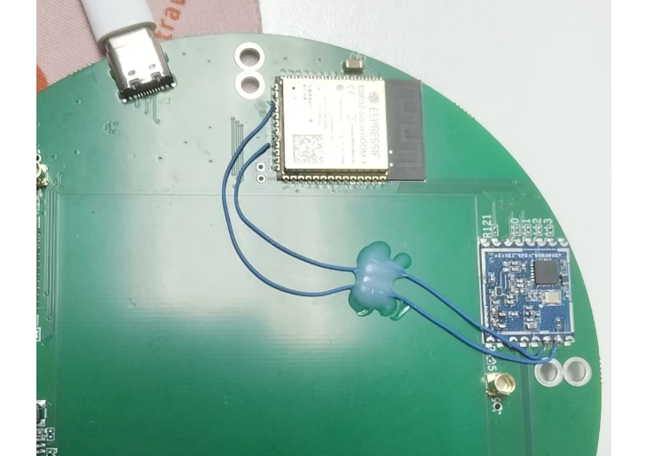

# Project Asuna

### LORA :

#define APP_LORA_SERVER_SPI_FREQ (4 * 1000 * 1000)
#define APP_LORA_SERVER_PIN_SCK  (12)
#define APP_LORA_SERVER_PIN_MOSI (11)
#define APP_LORA_SERVER_PIN_MISO (13)
#define APP_LORA_SERVER_PIN_CS   (10)
#define APP_LORA_SERVER_PIN_RST  (21)
#define APP_LORA_SERVER_PIN_INT  (9)
#define APP_LORA_SERVER_PIN_BUSY (14)

see:

## 使用，

* 烧录后，ESP自动启一个WIFI，密码为WIFI后面的数字。 
* 默认网页地址 192.168.4.1， 使用电脑连接WIFI，并且浏览器输入192.168.4.1
